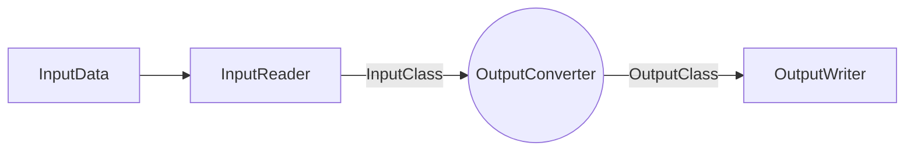

**"Q1 – JSON Assignment"**


JSON is a lightweight data exchange format. It is easy to read and write by human beings; and processed by any programming languages. The syntax of JSON is described in various references, one is from https://www.json.org. 

A sample json file is provided as attachment in the specification. 

The requirement of this assignment is to write a program that opens a json file with the same schema as the sample file provided (but with more items). 

The json file path is given as an argument
to the command line. 

The program retrieves the data in the json file and forms the data in a table.

    An inputFileContents is shown below.


### Json Format

```json

{
	"items":
		{
			"item":
				[
					{
						"id": "0001",
						"type": "Donut",
						"name": "Cake",
						"ppu": 0.55,
						"batters":
							{
								"batter":
									[
										{ "id": "1001", "type": "Regular" },
										{ "id": "1002", "type": "Chocolate" },
										{ "id": "1003", "type": "Blueberry" },
										{ "id": "1004", "type": "Devil's Food" }
									]
							},
						"topping":
							[
								{ "id": "5001", "type": "None" },
								{ "id": "5002", "type": "Glazed" },
								{ "id": "5005", "type": "Sugar" },
								{ "id": "5007", "type": "Powdered Sugar" },
								{ "id": "5006", "type": "Chocolate with Sprinkles" },
								{ "id": "5003", "type": "Chocolate" },
								{ "id": "5004", "type": "Maple" }
							]
					},
					{
						"id": "0002",
						"type": "Molten Cake",
						"name": "Lava Cake",
						"ppu": 0.70,
						"batters":
							{
								"batter":
									[
										{ "id": "1002", "type": "Chocolate" },
										{ "id": "1003", "type": "White Choco." },
										{ "id": "1004", "type": "Devil's Food" }
									]
							},
						"topping":
							[
								{ "id": "5001", "type": "None" },
								{ "id": "5002", "type": "Glazed" },
								{ "id": "5005", "type": "Sugar" },
								{ "id": "5007", "type": "Powdered Sugar" },
								{ "id": "5006", "type": "Chocolate with Sprinkles" },
								{ "id": "5003", "type": "Chocolate" },
								{ "id": "5004", "type": "Maple" },
								{ "id": "5008", "type": "Caramel"}
							]
					}

				]
		}
}

```

### OUTPUT

Id | Type | Name | Batter | Topping
---|------|------|--------|--------


### Usage: 

[path to your program] [input file path] [output file path]


/<home directory>/app/sample.json
/<home directory>/app/result/sortbyid.table


###Assignment Marking Scheme:
    
    •    Program correctness:
        o  Open file, read file data, form the table of data, write to file
        o  Command process
    • Program output format, clarity, completeness, and accuracy
    • Program indentation and readability
    • Choice of significant names for identifiers
    • Comments - description of variables and constants"


# Answer

> **Note:** This is an **extendable** application that can potentially read any data from any possible way and format and convert it to an output data and write it there





## Overview

1. Application parameters are parsed
2. Input data is read (based on parameters this can be json, or any other format)
3. Based on the desired format (in this inputFileContents it is table) data are converted to a format that is usable for output
4. Based on output parameters, application flashsout output 

## Application Usage

This is a maven project you can build or run using maven install
Jar file will be located at target folder
```json-test-application-1.0-SNAPSHOT.jar```

if you want to directly call the application without using maven ,
```java -cp "target/json-test-application-1.0-SNAPSHOT.jar" biz.aceresources.json.App Sample.json output.table```

###Usage

```shell
Usage: <main class> [-AhpsV] [-i=INPUT_FORMAT] [-o=OUTPUT_FORMAT] <inputFile>
                    <outputFile>
      <inputFile>            The input file address
      <outputFile>           File address for the output file. Conversion
                               results will be saved there
  -A, --append               if true, then bytes will be written to the end of
                               the file rather than the beginning
  -h, --help                 display a help message
  -i, --input=INPUT_FORMAT   Optionally specify the input format (TXT, JSON, CSV, PDF, DOC).       'If omitted the default type is used.' , Currently only JSON is supported
  -o, --output=OUTPUT_FORMAT Optionally specify the output format (TXT, JSON,  CSV, PDF, DOC).
                             'If omitted the default type is used.' , Currently
                               only TXT is supported
  -p, --print                Show output in terminal
  -s, --silence              Hide debugging information
  -V, --version              print version information and exit

```

## Developer Guideline
Do not forget to run ```mvn clean install``` before testing using terminal

### ADD NEW INPUT FORMATS
//TBD

### ADD NEW OUTPUT FORMAT
//TBD

### ARCHITECTURE
//TBD
